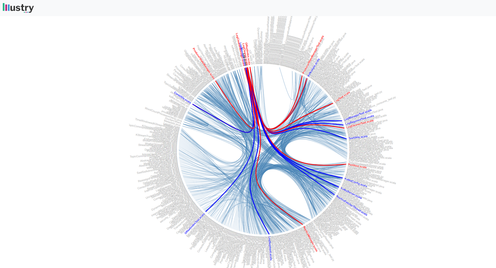
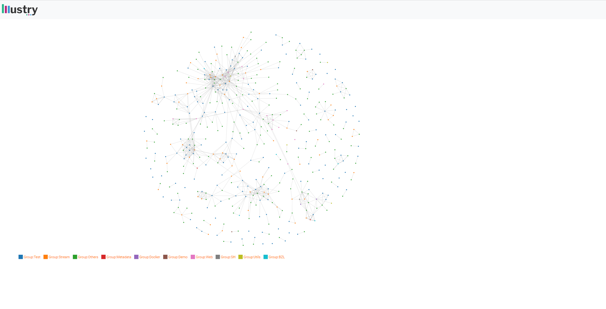
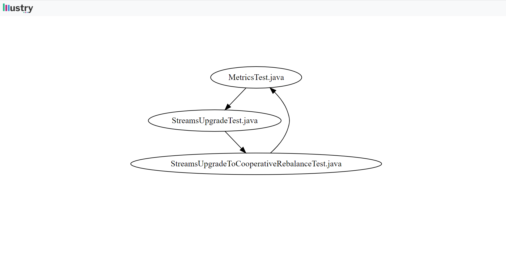
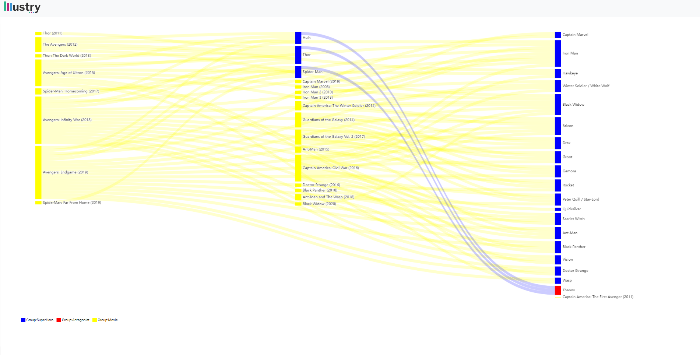
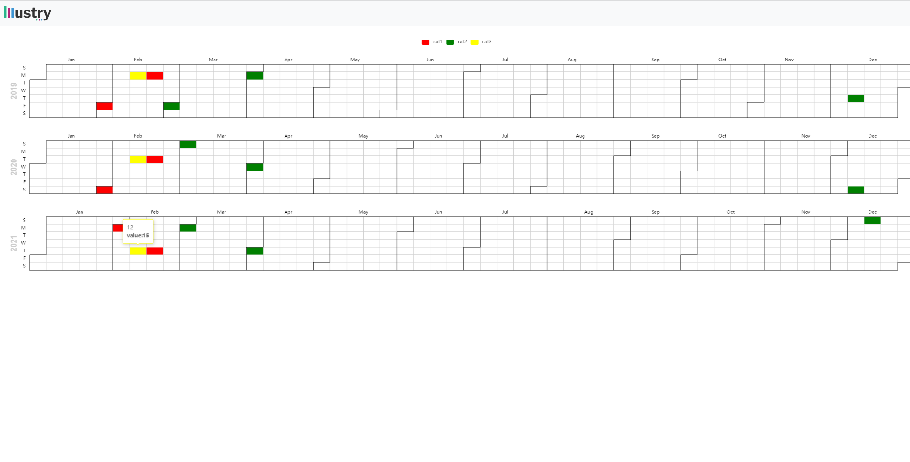
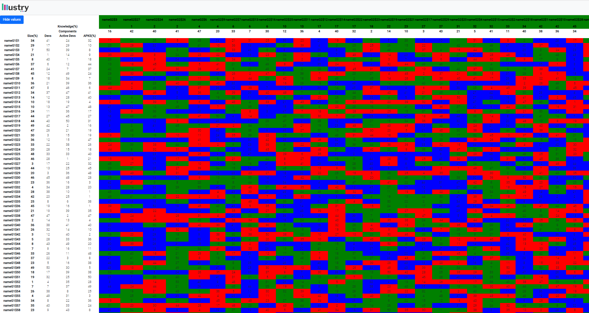

# Getting started

Illustry provides 2 types of resources that can be stored in the database: Projects and Illustrations.
If you want to check the specific types: O SA PUN LINK AICI. The API documentation could be found at [Swagger](http://localhost:7000/api-docs/)

## Projects

Project is a generic name for a resource that stores many illustrations.

    The structure of the project is:
    {
        ProjectName: "", #the selected name of the project, it's a primary key, it could not be changed after
        ProjectDescription: "" #description of the project
    }

<!--  -->

## Illustrations

Illustration is a resource that represent one of the following visualizations:

- Hierarchical Edge bundling
- Force Layout Graph
- Sankey diagram
- Dot
- Calendar
- Matrix
- Treemap?
- Timeline
- [Echarts visualizations](https://echarts.apache.org/en/api.html#echarts)

## HEB

Adjacency links between elements structured in a hierarchy can be seen using Hierarchical Edge Bundling.
It lowers visual clutter while also seeing implicit adjacency edges between parent nodes that come from explicit adjacency edges between their corresponding child nodes.

Pros:

- shows which entity produced the change by the color of the relationships
- the relations have tooltip that represent how strong are the entities actually coupled

Cons:

- clustering is hard to be seen

Model:

    {
        "illustrationName": "Heb test", # the selected name of the illustration, it's a primary key, it could not be changed after
        "illustrationType": "heb" , # type of the illustration
        "tags": ["tag1", "tag2"], # simply tags for search
        "illustrationData": {
            "nodes": [
                {
                 "group": "Test", #group represent the folder/property that shares multiple entities
                 "id": "MetricsTest.scala" #id name of the entity
                },
                {
                 "group": "Test",
                 "id": "StreamsUpgradeTest.java"
                },
                ...
            ]
            "links": [
               {
                "source": "StreamsUpgradeTest.java", #source of the link represent which entity is the influencer
                "target": "MetricsTest.scala",  # target of the link represent which entity is influenced
                "value": 100    # how strong/week the influence actually is
                },
                ...
            ]
    }

Result:

## FLG

It's a clustered visualization, where the entites are presented as dots of different colors, the entities
The color of the dots is for the representation of a specific cluster.

Pros:

- clustering is really easy to see
- revealing Hubs

Cons:

- hard to see one-to-one relations
- impossible to spot layers (flow / hierarchy of relations)

Model:

    {
        "illustrationName": "Flg test", #the selected name of the illustration, it's a primary key, it could not be changed after
        "illustrationType": "flg" , # type of the illustration
        "tags": ["tag1", "tag2"], # simply tags for search
        "illustrationData": {
            "nodes": [
                {
                 "group": "Test", #group represent the folder/property that shares multiple entities
                 "id": "MetricsTest.scala" #id name of the entity
                },
                {
                 "group": "Test",
                 "id": "StreamsUpgradeTest.java"
                },
                ...
            ]
            "links": [
               {
                "source": "StreamsUpgradeTest.java", #source of the link represent which entity is the influencer
                "target": "MetricsTest.scala",  # target of the link represent which entity is influenced
                "value": 100    # how strong/week the influence actually is
                },
                ...
            ]
    }

Result:

## DOT

It's a visualization that is designed to see the class hierarchy of a project, it is based on the .dot language

Pros:

- very easy to follow in a folder-level

Cons:

- very hard to follow in an entire project-level

Model:

    {
        "illustrationName": "Dot test", #the selected name of the illustration, it's a primary key, it could not be changed after
        "illustrationType": "graphiz" , # type of the illustration
        "tags": ["tag1", "tag2"], # simply tags for search
        "illustrationData": {
            "nodes": [
                {
                 "group": "Test", #group represent the folder/property that shares multiple entities
                 "id": "MetricsTest.scala" #id name of the entity
                },
                {
                 "group": "Test",
                 "id": "StreamsUpgradeTest.java"
                },
                ...
            ]
            "links": [
               {
                "source": "StreamsUpgradeTest.java", #source of the link represent which entity is the influencer
                "target": "MetricsTest.scala",  # target of the link represent which entity is influenced
                "value": 100    # how strong/week the influence actually is
                },
                ...
            ]
    }

Result:

## Sankey

Sankey diagrams are used to depict weighted networks, also known as flows. It may happen with a variety of data structures:
The nodes are replicated in two or more groups that reflect phases of progression. Connections, like in the migration example above, represent the progression of two states. This is most commonly shown as a chord diagram.
Consider a total quantity; the diagram depicts where it originates from and where it finishes up, as well as any intermediary steps. Each node is distinct.

Pros:

- easy to follow a "flow" since all the other routes disappear when a user hovers
- good to see the bigger picture of all the flows
- good to see inconsistency since the width of the links dictate the actual value
- nodes can be drag and dropped
- each node and link have properties that could be displayed

Cons:

- If the nodes are not spaced out well, the Sankey diagram cannot highlight an actionable insight, because of the link overlapping and could result in cluttering

Model:

    {
    "illustrationName": "Sankey Test", #the selected name of the illustration, it's a primary key, it could not be changed after
    "illustrationType": "sankeydiagram", # type of the illustration
    "tags": ["tag1", "tag2"], # simply tags for search
    "illustrationData": {

        "nodes": [
            {
                "id": "Captain America: The First Avenger (2011)",   #id name of the entity
                "group": "Movie", #group represent the folder/property that shares multiple entities
                "properties": {         #properties to be displayed in a tooltip
                    "duration": "120 min",
                    "worth": 100 mil,
                }
            },
            {
                "id": "Captain Marvel (2019)",
                "group": "Movie",
                "properties": {
                    "duration": "130 min",
                    "worth": 300 mil,
                }
            },
            ...
            ],
        "links": [  #links can go only one direction Ex: if(a->b->c) then c->a is not a valid link
                 {
                    "source": "Avengers: Endgame (2019)",
                    "target": "Captain America",
                    "value": 1
                ...
                }
            ]
        }
    }

Result:

## Calendar

The calendar visualization represent events that occurs overtime in a year.
Every calendar date could have specific properties(color, properties that are special events on that specific day would be shows in via tooltip).

Pros:

- very familiar visualization for developers, the model seems very similiar to the one that Github uses
- clustering could be seen very easily via color
- many events would be shown in the calendar via the tooltip
- simple filtering via the legend

Cons:

- Too many calendar years will result in a scroll

Model:

    {
    "illustrationName": "Calendar Matrix Test", #the selected name of the illustration, it's a primary key, it could not be changed after
    "illustrationType": "calendarmatrix", # type of the illustration
    "tags": ["tag1", "tag2"], # simply tags for search
    "illustrationData": {
        "calendar": [{
                "date": "2019-02-01", # date to be represented
                "value": 15,    # value of the metric
                "year": 2019,   # year to be displayed
                "category": "cat1" # category to be colored accordingly
            },
            {
                "date": "2019-02-18",
                "value": 27,
                "year": 2019,
                "category": "cat1"
            },
            {
                "date": "2019-03-01",
                "value": 39,
                "year": 2019,
                "category": "cat2"
            },
            {
                "date": "2019-04-01",
                "value": 50,
                "year": 2019,
                "category": "cat2"
            },
            {
                "date": "2019-12-12",
                "value": 15,

                "year": 2019,
                "category": "cat2"
            },
            {
                "date": "2019-02-11",
                "value": 15,
                "year": 2019,
                "category": "cat3"
            },
            {
                "date": "2020-02-01",
                "value": 15,
                "year": 2020,
                "category": "cat1"
            },
            {
                "date": "2020-02-18",
                "value": 27,
                "year": 2020,
                "category": "cat1"
            },
            {
                "date": "2020-03-01",
                "value": 39,
                "year": 2020,
                "category": "cat2"
            },
            {
                "date": "2020-04-01",
                "value": 50,
                "year": 2020,
                "category": "cat2"
            },
            {
                "date": "2020-12-12",
                "value": 15,
                "year": 2020,
                "category": "cat2"
            },
            {
                "date": "2020-02-11",
                "value": 15,
                "year": 2020,
                "category": "cat3"
            },
            {
                "date": "2021-02-01",
                "value": 15,
                "year": 2021,
                "category": "cat1"
            },
            {
                "date": "2021-02-18",
                "value": 27,
                "year": 2021,
                "category": "cat1"
            },
            {
                "date": "2021-03-01",
                "value": 39,
                "year": 2021,
                "category": "cat2"
            },
            {
                "date": "2021-04-01",
                "value": 50,
                "year": 2021,
                "category": "cat2"
            },
            {
                "date": "2021-12-12",
                "value": 15,
                "year": 2021,
                "category": "cat2"
            },
            {
                "date": "2021-02-11",
                "value": 15,
                "year": 2021,
                "category": "cat3"
            }
        ],

        "categories": {
            "cat1": "red",  //split of the categories
            "cat2": "green",
            "cat3": "yellow"
        },

        "tooltip": {
            "2021-02-11": "
12
",  //properties to be visualized in a css form
            "2021-12-12": {
                "Prop": 1,                  // properties just to be visualized
                "prop2": "@3332"
                }
            }
        }
    }

Result:

## Matrix

The matrix gives an overview of the associations between a set of entities and a set of associates of a given type. The key patterns revealed by matrixes are:

- polarization: an associate has a very large share of an entities associations;
- influence: one associate is connected to many/few entities;
- connectivity: one entity has many/few associates;
- correlations: a group of entities that share a group of common associates

Pros:

- very good to see big chunks of associative data
- filtering of data on collumns and on rows
- properties of the data are shown
- button for all the numbers to dissapear

Cons:
- since there is a large amount of data, sometimes the filtering goes slower
- if the matrix is to big, scroll is needed

Model:

    {   "illustrationName": "Test matrix", #the selected name of the illustration, it's a primary key, it could not be changed after
    "illustrationType": "matrix", # type of the illustration
    "tags": ["tag1", "tag2"], # simply tags for search
    "illustrationData": {
        "nodes": [{
            "name": "nameG1$1", # name of the entity that will be displayed either on header or on first collumn
            "group": 1, # group can be 1 or 2, if it's one it means that it will be the collumn, if it's 2 the header
            "properties": [{    
                "label": "Size(%)", # the number of labels represent the either the first collumns or the first rows
                "value": 34,    # value to be displayed, they have their own styles
                "style": {
                    "font-weight": "bold",
                    "color": "green"
                }
            }, {
                "label": "Devs",
                "value": 41,
                "style": {
                    "font-weight": "bold"
                }
            }, {
                "label": "Active Devs",
                "value": 24,
                "style": {
                    "font-weight": "bold"
                }
            }, {
                "label": "APKS(%)",
                "value": 32,
                "style": {
                    "font-weight": "bold"
                }
            }],
            "style": {
                "font-weight": "bold",
                "color": "green"
                }
            }
            ...
            ],
            "links": [{
            "source": "nameG1$1",   $ represent the intersection between the rows and the collumns
            "target": "nameG2$1",
            "value": 11,
            "style": {
                "background-color": "blue"
            }
        }
        ...
        ]
        }
    }

Result:

## Timeline 

The main purpose of timelines is to show: 

- evolution trends (e.g. upward, downward, flat/stagnant); 
- variability: namely the average degree of change from one point in time to the next, possibly showing steep growth or steep decline. 

Pros:

- very familiar with the git commit timeline
- filtering of data and pagination

Cons: 

- sometimes scroll must be purceeded

Model:

    {
    "illustrationName": "Test timeline", #the selected name of the illustration, it's a primary key, it could not be changed after
    "illustrationType": "timeline", # type of the illustration
    "tags": ["tag1", "tag2"], # simply tags for search
    "illustrationData": {
        "2022-02-01": {         # specific date
            "events": [{
                    "date": "2022-02-01 10:40", # date with hour
                    "summary": "very big commit",   # description of the action
                    "type": "commit",   #type of the action
                    "author": "john"    # who did the action
                },
                {
                    "date": "2022-02-01 13:43",
                    "summary": "changing some variables",
                    "type": "commit",
                    "author": "max"
                },
                {
                    "date": "2022-02-01 14:40",
                    "summary": "'",
                    "type": "issue",
                    "author": "john"
                }
            ]
        },
        ...
        }
    }

Result:

## Echarts

[Echarts](https://echarts.apache.org/en/index.html) is an open-source Javascript visualization library that permits any user to have almost any kind of visualizations.
Since the main scope of Illustry is to visualize any kind of data, almost any kind of echarts configuration could be ported in Illustry.
Just copy paste any option of echarts option that are presented in their example and it will be represented via Illustry.
